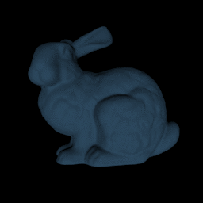
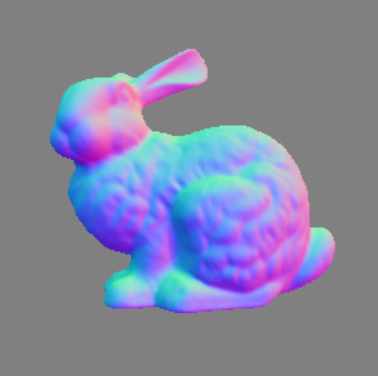

# Photometric Stereo Test

written by Heng Guo (heng.guo@ist.osaka-u.ac.jp)

### What is Photometric Stereo?

Photometric Stereo is an approach to determining surface normal of 
a scene from a set of images recorded from a fixed viewpoint but under
varying lighting conditions.

### Dependencies
The code is written in Python 3.6 but should be able to adapt it to Python 2.x if needed.
You might need the following Python packages installed:
* `cv2` (OpenCV, used for image I/O)
* `glob` (used for reading out a list of images)
* `numpy` (main computation depends on matrix operations)
* `sklearn` (scikit-learn, used for normalization of array)

### Task A: Photometric Stereo Algorithm
- [ ] Read tutorial PDF of Photometric Stereo 
- [ ] Complete the code in `rps.py` from Line 106 
- [ ] run `python demo.py` and check the mean angular error value
- [ ] Send the value of mean angular error to [guoheng.bupt@gmail.com](guoheng.bupt@gmail.com)

PS: Key solution is the least square in Page 14 of the tutorial PDF. If your code is correct, you will get a figure like this:

### Task B: Git and GitHub
- [ ] Read [GitExtensions tutorial](https://www.cnblogs.com/ningboliuwei/p/6606279.html)
- [ ] Commit your changes of `rps.py`
- [ ] Push this project to your own GitHub repository
- [ ] Send the link of your repository to [guoheng.bupt@gmail.com](guoheng.bupt@gmail.com)

PS: You can use other git tool to push your code to GitHub, but you need to make sure to send the repository link to me. 

### References
-  [Video1](https://www.youtube.com/watch?v=mw43A8Y6Nlg&t=90s)
-  [Video2](https://www.youtube.com/watch?v=dNkMLqBUNKI)

